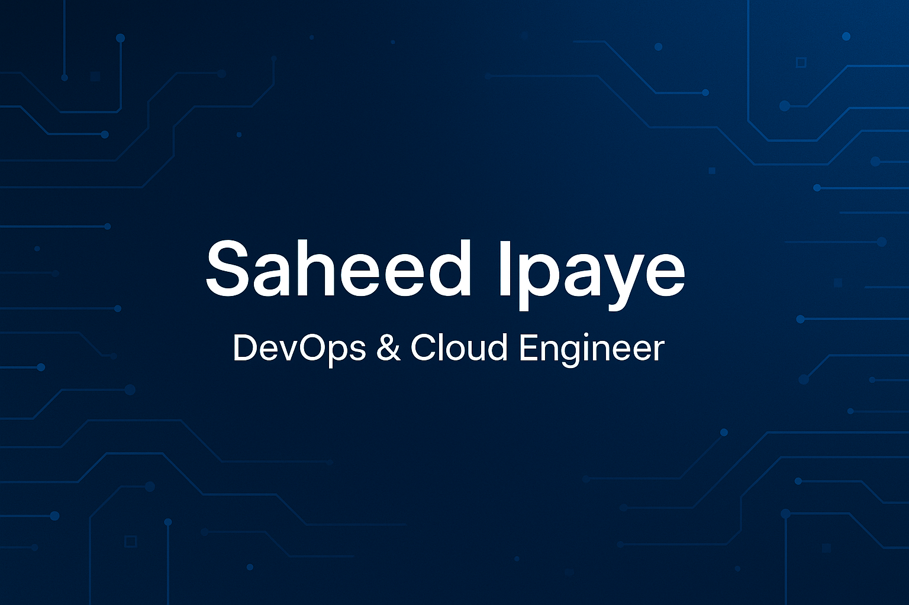

<h1 align="center">Hi there 👋 I'm Saheed, a DevOps Engineer</h1>

  

  

### About Me

Detail-oriented and results-driven **DevOps Engineer** with over **5+ years of experience** in:

- Cloud infrastructure (AWS & GCP)
- Container orchestration (Docker, Kubernetes)
- CI/CD pipeline automation (GitHub Actions, Jenkins)
- Infrastructure as Code (Terraform, Helm, Ansible)
- Monitoring & Logging (Prometheus, Grafana, ELK Stack)
- Bash & Python scripting for automation

I’m passionate about optimizing deployment workflows, reducing production incidents, and delivering secure, scalable systems in agile environments.

---

### Technical Skills

| Domain                  | Tools / Technologies                                       |
|-------------------------|-------------------------------------------------------------|
| **OS & Scripting**      | Linux (Ubuntu, Debian), MacOS, Bash, Shell, Python         |
| **Cloud Platforms**     | AWS, GCP (EC2, VMs, CLI)                                    |
| **Containers**          | Docker, Docker Compose, Kubernetes                          |
| **CI/CD & IaC**         | GitHub Actions, Jenkins, Terraform, Helm, Ansible           |
| **Monitoring & Logging**| Prometheus, Grafana, ELK Stack                              |
| **Version Control**     | Git, GitHub (SSH-based)                                     |
| **DNS & Domains**       | Cloudflare, SSL/TLS, Let's Encrypt                          |

---

### Featured Projects

#### **Automated Web App Deployment with Docker & SSL**
- Docker Compose deployment for full-stack app
- NGINX reverse proxy setup
- SSL configuration via Let’s Encrypt
- Domain/DNS managed via Cloudflare

#### **Web App Deployment on AWS EC2**
- Dockerized services deployed to EC2
- NGINX configured for reverse proxy routing
- GitHub Actions used for deployment automation

**Highlights:**
- Built multi-container Docker apps
- Enhanced reliability with load balancing and automation

### Certifications 
-  PG in DevOps — Edureka  
-  **AWS Certifications:**
  - Cloud Practitioner Essentials  
  - Getting Started with Networking  
  - Getting Started with Security  
  - Introduction to Generative AI  

---
**Tech Stack**

  
  
  
  
  
  
  
  
  
  
  
  
  
  

### GitHub Stats

  
  

---

### 📫 Let's Connect

  
  

