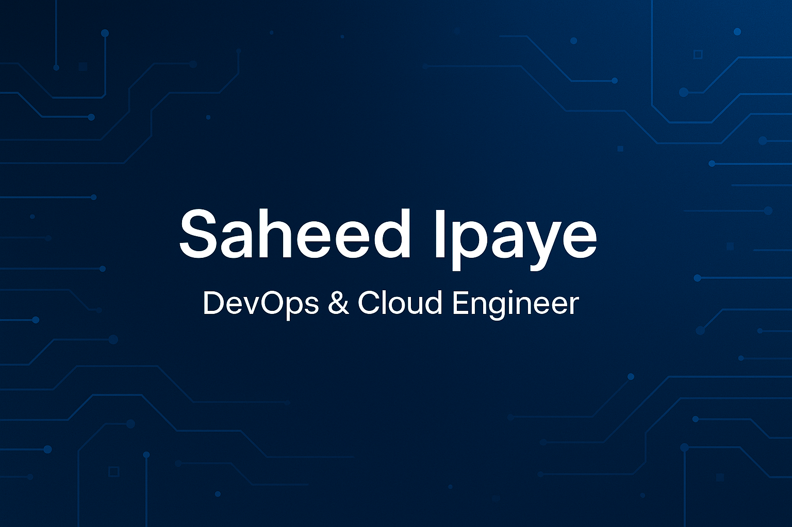

<h1 align="center">Hi there 👋 I'm Saheed, a DevOps Engineer</h1>

  

  

### About Me

Detail-oriented and results-driven **DevOps/Cloud Engineer** with over **3+ years of experience** in:

- Cloud infrastructure (AWS & GCP)
- Container orchestration (Docker, Kubernetes)
- CI/CD pipeline automation (GitHub Actions, Jenkins)
- Infrastructure as Code (Terraform, Cloud Formation)
- Monitoring & Logging (Prometheus, Grafana)
- Bash & Python scripting for automation

I’m passionate about optimizing deployment workflows, reducing production incidents, and delivering secure, scalable systems in agile environments.

---

### Technical Skills

| Domain                  | Tools / Technologies                                       |
|-------------------------|-------------------------------------------------------------|
| **OS & Scripting**      | Linux (Ubuntu, Debian), MacOS, Bash, Shell, Python         |
| **Cloud Platforms**     | AWS, GCP (EC2, VMs, CLI)                                    |
| **Containers**          | Docker, Docker Compose, Kubernetes                          |
| **CI/CD & IaC**         | GitHub Actions, Jenkins, Terraform,                         |
| **Monitoring & Logging**| Prometheus, Grafana,                                        |
| **Version Control**     | Git, GitHub (SSH-based)                                     |
| **DNS & Domains**       | Cloudflare, SSL/TLS, Let's Encrypt                          |

---

### Featured Projects

#### **E-commerce-Application**
A full-stack, containerized e-commerce payment platform designed and deployed using modern DevOps best practices. The project combines an interactive frontend with a Node.js + Express REST API for product management and payment processing. Infrastructure provisioning, configuration, and deployment are fully automated using Terraform (IaC) and a GitHub Actions CI/CD pipeline that builds, pushes, and deploys Docker images from Docker Hub to an AWS EC2 instance. Key Highlights: End-to-end automation from code commit to live deployment Cloud infrastructure provisioning using reusable and modular Terraform templates CI/CD pipeline integration with GitHub Actions for continuous build and deployment Secure and optimized Docker images, leveraging multi-stage builds and non-root containers Production-ready payment API — reduced Docker image size by 88% (1.57 GB → 189 MB) Node.js + Express + Docker best practices applied for scalability, maintainability, and security

Skills: docker · Node.js · Cloud Platforms: AWS (EC2, CLI), Docker, Docker Compose · Version Control: Git, GitHub · Terraform · HTML Scripting

Key Highlights:
End-to-end automation from code commit to live deployment
Cloud infrastructure provisioning using reusable and modular Terraform templates
CI/CD pipeline integration with GitHub Actions for continuous build and deployment
Secure and optimized Docker images, leveraging multi-stage builds and non-root containers
Production-ready payment API — reduced Docker image size by 88% (1.57 GB → 189 MB)
Node.js + Express + Docker best practices applied for scalability, maintainability, and security

#### **Terraform Ecommerce_ APP Setup**
Production-grade AWS infrastructure automation using Terraform to deploy an E-Commerce Payment APP. Features modular design with custom VPC, multi-AZ subnets, security groups, and automated EC2 provisioning. Infrastructure provisions in 4 minutes with complete network isolation, encrypted storage, and automated Docker container deployment for a Node.js payment processing application.
Production-grade AWS infrastructure automation using Terraform to deploy an E-Commerce Payment APP. Features modular design with custom VPC, multi-AZ subnets, security groups, and automated EC2 provisioning. Infrastructure provisions in 4 minutes with complete network isolation, encrypted storage, and automated Docker container deployment for a Node.js payment processing application.
Skills: Terraform · DevOps Tools & Practices: CI/CD Pipelines, GitHub Actions, Automation, Bash/Shell Scripting · Version Control: Git, GitHub.

#### **Cloudflare-Enabled Secure Deployment for Node.js E-Commerce App**
Secured my Node.js E-Commerce app with Cloudflare, moving from a public IP to a custom domain (dev.saheedipayetech.com) and enabling HTTPS using Certbot. Configured Nginx as a reverse proxy for efficient traffic routing and implemented HTTP → HTTPS redirection. This setup ensures a secure, performant, and globally accessible web application, showcasing hands-on expertise in cloud deployment, SSL management, and web security best practices.
Secured my Node.js E-Commerce app with Cloudflare, moving from a public IP to a custom domain (dev.saheedipayetech.com) and enabling HTTPS using Certbot. Configured Nginx as a reverse proxy for efficient traffic routing and implemented HTTP → HTTPS redirection. This setup ensures a secure, performant, and globally accessible web application, showcasing hands-on expertise in cloud deployment, SSL management, and web security best practices.
Skills: Cloudflare · Domain Name System (DNS) · SSL Certificates · Nginx

#### **Monitoring Stack with Prometheus & Grafana**
A complete, production-ready monitoring and observability stack for modern applications. This project provides real-time metrics collection, visualization, and alerting using industry-standard tools. This monitoring stack is designed to provide comprehensive observability for the E-Commerce Payment API and its underlying infrastructure. It demonstrates professional DevOps monitoring practices suitable for production environments.
Skills: Cloud Platforms: AWS (EC2, CLI), Docker, Docker Compose · Prometheus.io · Grafana

### Certifications 
-  PG in DevOps — Edureka
-  Google Cybersecurity professional Certificate
-  AWS Certified Cloud Practitioner  
       

---
**Tech Stack**

  
  
  
  
  
  
  
  
  
  
  
  
  
  

### GitHub Stats

  
  

---

### 📫 Let's Connect

  
  

